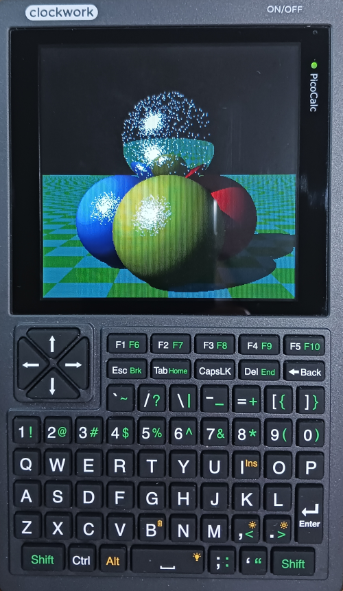

# phyllosoma
MachiKania type P (aka MachiKania Phyllosoma) for ClockworkPi PicoCalc (hereafter referred to as PicoCalc)  


## MachiKania Phyllosoma
MachiKania Phyllosoma is a BASIC compiler for ARMv6-M, especially for Raspberry Pi Pico.

## how to compile for Raspberry Pi Pico
cmake and make. The pico-sdk (ver 2.1.1 is confirmed for building) with all submodules (execute "Submodule Update" for git clone) is required. In config.cmake, select configuration option to build by enabling "set()" command. Currently, there is following option:  
  
1. set(MACHIKANIA_BUILD pico_picocalc) : for PicoCalc  

## how to compile for Raspberry Pi Pico W

Add "-DPICO_BOARD=pico_w -DPICO_PLATFORM=rp2040" parameter to execute cmake, then execute make. The config.cmake setting is the same as above.

## how to compile for Raspberry Pi Pico 2

Add "-DPICO_BOARD=pico2 -DPICO_PLATFORM=rp2350-arm-s" parameter to execute cmake, then execute make. The config.cmake setting is the same as above.

## how to compile for Raspberry Pi Pico 2 W

Add "-DPICO_BOARD=pico2_w -DPICO_PLATFORM=rp2350-arm-s" parameter to execute cmake, then execute make. The config.cmake setting is the same as above.

## how to use
Connect USB-micro B adaptor to PicoCalc with pushing BOOTSEL button of Raspberry Pi Pico. Copy "phyllosoma_kb.uf2" to the RPI-RP2 (or RP2350) drive of Raspberry Pi Pico or Pico W. 

## License
Most of codes (written in C) are provided with LGPL 2.1 license, but some codes are provided with the other licenses. See the comment of each file.

## Port assignment
The I/O ports are assigned as follows:

```console
GP0 I/O bit0 / PWM3 / I2C SDA / button1 (UP)
GP1 I/O bit1 / PWM2 / I2C SCL / button2 (LEFT)
GP2 I/O bit2 / PWM1 / button3 (RIGHT)
GP3 I/O bit3 / SPI CS / button4 (DOWN)
GP4 I/O bit4 / UART TX / button5 (START)
GP5 I/O bit5 / UART RX / button6 (FIRE)
GP6 I2C1_SDA (Keyboard)
GP7 I2C1_SCL (Keyboard)
GP8 I/O bit6 / I/O bit8
GP9 I/O bit7 / I/O bit9
GP10 SPI1_SCK（LCD）
GP11 SPI1_TX（LCD）
GP12 SPI1_RX（LCD）
GP13 SPI1_CS（LCD）
GP14 LCD_DC（LCD）
GP15 LCD_RST（LCD）
GP16 SPI0_RX（MMC）/ SPI RX (pulled up by a 10k ohm resistor)
GP17 SPI0_CS（MMC）
GP18 SPI0_SCK（MMC）
GP19 SPI0_TX（MMC）
GP20 I/O bit10
GP21 I/O bit11
GP22 I/O bit12
GP26 I/O bit13 / ADC0
GP27 I/O bit14 / SOUND OUT / ADC1
GP28 I/O bit15 / ADC2
GP29 ADC3
```
## Using Keyboard
The phyllosoma_kb.uf2 firmware supports using the built-in keyboard of PicoCalc.

## Using arrow keys for button function
The four arrow keys and space/enter keys of keyboard emulate button functions of MachiKania. To change the assignment (which keys are used for which button), edit MACHIKAP.INI (EMULATEBUTTONxx=yyy etc) 

## LCD settings
To use correct direction of LCD, set "VERTICAL" in MACHIKAP.INI. The "LCDINVERT" is also required for correct colorings.


