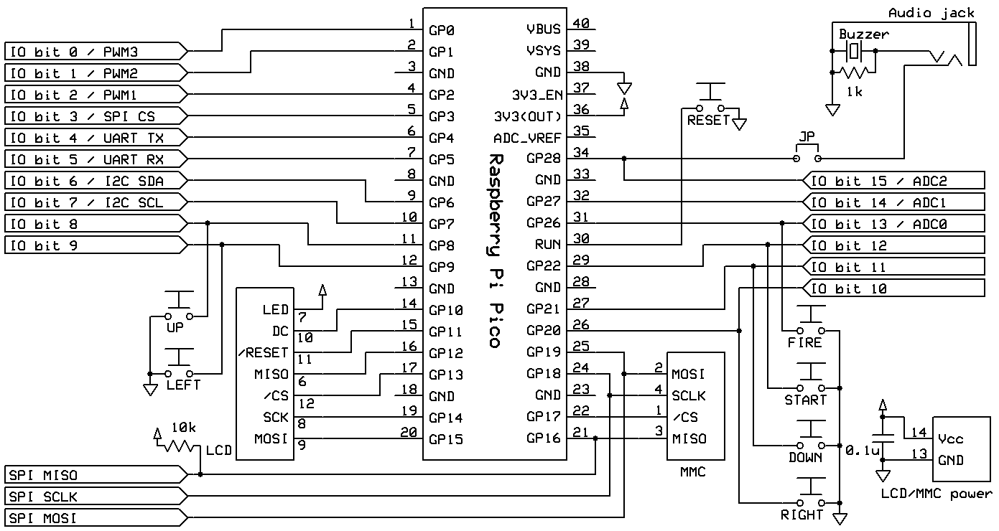

# phyllosoma
MachiKania Phyllosoma

## MachiKania Phyllosoma
MachiKania Phyllosoma is a BASIC compiler for ARMv6-M, especially for Raspberry Pi Pico.

## how to compile
cmake and make. The pico-sdk (ver 1.5.0 is confirmed for building) with tinyusb submodule (ver 0.15.0 is confirmed for building) is required. In config.cmake, select configuration option to build by enabling "set()" command. Currently, there are following options:  
  
1. set(MACHIKANIA_BUILD pico_ili9341) : for Raspberry Pi Pico + ILI9341 LCD  
2. set(MACHIKANIA_BUILD pico_ili9488) : for Raspberry Pi Pico + ILI9488 LCD  
3. set(MACHIKANIA_BUILD xiao_embed) : for Seeed XIAO RP2040 for embedded development  
4. set(MACHIKANIA_BUILD pico_w_ili9341) : for Raspberry Pi Pico W + ILI9341 LCD + Wifi  
5. set(MACHIKANIA_BUILD pico_w_ili9488) : for Raspberry Pi Pico W + ILI9488 LCD + Wifi

## how to use
Copy "phyllosoma.uf2" to the RPI-RP2 drive of Raspberry Pi Pico. Immediately connect to COMx port (com number depends on environment) by serial console at 115200 baud rate, if needed. Alternatively, copy "phyllosoma_kb.uf2" to the RPI-RP2 drive of Raspberry Pi Pico for using USB keyboard directly connected to Raspberry Pi Pico.

## License
Most of codes (written in C) are provided with LGPL 2.1 license, but some codes are provided with the other licenses. See the comment of each file.

## Connection
Connect a Raspberry Pi Pico to an ILI9341-based LCD (SPI connection) and an MultiMediaCard (SPI connection) as follows.

Note that USB keyboard is connected to micro-USB B port of Raspberry Pi Pico board when required.

```console
GP0 I/O bit0 / PWM3
GP1 I/O bit1 / PWM2
GP2 I/O bit2 / PWM1
GP3 I/O bit3 / SPI CS
GP4 I/O bit4 / UART TX
GP5 I/O bit5 / UART RX
GP6 I/O bit6 / I2C SDA
GP7 I/O bit7 / I2C SCL
GP8 I/O bit8 / button1 (UP)
GP9 I/O bit9 / button2 (LEFT)
GP10 LCD-DC
GP11 LCD-RESET
GP12 LCD-MISO
GP13 LCD-CS
GP14 LCD-SCK
GP15 LCD-MOSI
GP16 SD-DO(MISO) / SPI RX (pulled up by a 10k ohm resistor)
GP17 SD-CS
GP18 SD-SCLK / SCK
GP19 SD-DI(MOSI) / SPI TX
GP20 I/O bit10 / button3 (RIGHT)
GP21 I/O bit11 / button4 (DOWN)
GP22 I/O bit12 / button5 (START)
GP26 I/O bit13 / button6 (FIRE) / ADC0
GP27 I/O bit14 / ADC1
GP28 I/O bit15 / SOUND OUT / ADC2
GP29 ADC3
```
## Using Keyboard
The phyllosoma_kb.uf2 firmware supports using USB keyboard. Connect the USB keyboard to micro B socket of Raspberry Pi pico through an USB-OTG cable, and supply 5V power to VBUS pin (#40).  
Alternatevely, as before, the phyllosoma.uf2 firmware supports the USB serial connection between MachiKania and PC.
