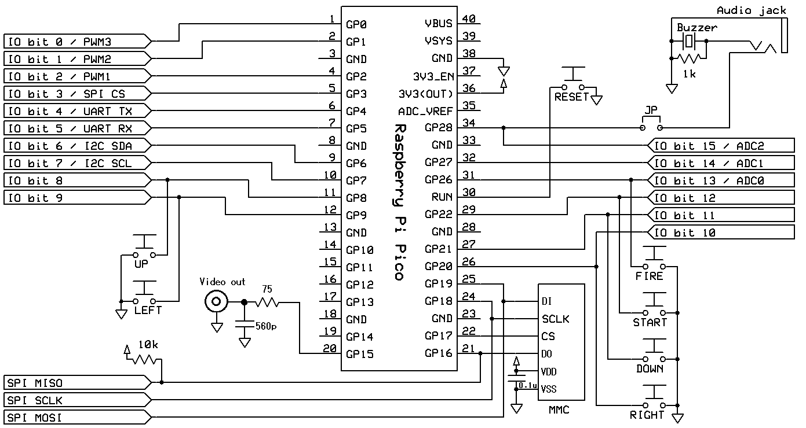
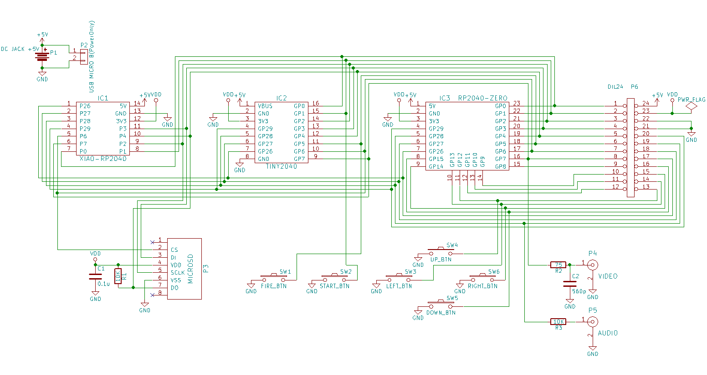

# phyllosoma
MachiKania Phyllosoma

## MachiKania Phyllosoma
MachiKania Phyllosoma is a BASIC compiler for ARMv6-M, especially for Raspberry Pi Pico.

## how to compile for Raspberry Pi Pico
cmake and make. The pico-sdk (ver 2.1.1 is confirmed for building) with all submodules (execute "Submodule Update" for git clone) is required. In config.cmake, select configuration option to build by enabling "set()" command. Currently, there are following options:  
  
1. set(MACHIKANIA_BUILD pico_ili9341) : for Raspberry Pi Pico + ILI9341 LCD  
2. set(MACHIKANIA_BUILD pico_ili9488) : for Raspberry Pi Pico + ILI9488 LCD  
3. set(MACHIKANIA_BUILD xiao_embed) : for Seeed XIAO RP2040 for embedded development (deprecated; edit MACHIKAP.INI for changing pin numbers for SPI/I2C/UART, instead)

## how to compile for Raspberry Pi Pico W

Add "-DPICO_BOARD=pico_w -DPICO_PLATFORM=rp2040" parameter to execute cmake, then execute make. The config.cmake setting is the same as above.

## how to compile for Raspberry Pi Pico 2

Add "-DPICO_BOARD=pico2 -DPICO_PLATFORM=rp2350-arm-s" parameter to execute cmake, then execute make. The config.cmake setting is the same as above.

## how to compile for Raspberry Pi Pico 2 W

Add "-DPICO_BOARD=pico2_w -DPICO_PLATFORM=rp2350-arm-s" parameter to execute cmake, then execute make. The config.cmake setting is the same as above.

## how to use
Copy "phyllosoma.uf2" to the RPI-RP2 (or RP2350) drive of Raspberry Pi Pico or Pico W. Immediately connect to COMx port (com number depends on environment) by serial console at 115200 baud rate, if needed. Alternatively, copy "phyllosoma_kb.uf2" to the RPI-RP2 drive for using USB keyboard directly connected to Raspberry Pi Pico (or Pico W).

## License
Most of codes (written in C) are provided with LGPL 2.1 license, but some codes are provided with the other licenses. See the comment of each file.

## Connection
Connect a Raspberry Pi Pico to an ILI9341/ILI9488-based LCD (SPI connection) and an MultiMediaCard (SPI connection) as follows.

Note that USB keyboard is connected to micro-USB B port of Raspberry Pi Pico (or Pico W) board when required.

```console
GP0 I/O bit0 / PWM3
GP1 I/O bit1 / PWM2
GP2 I/O bit2 / PWM1
GP3 I/O bit3 / SPI CS
GP4 I/O bit4 / UART TX
GP5 I/O bit5 / UART RX
GP6 I/O bit6 / I2C SDA
GP7 I/O bit7 / I2C SCL
GP8 I/O bit8 / button1 (UP)
GP9 I/O bit9 / button2 (LEFT)
GP10 LCD-DC
GP11 LCD-RESET
GP12 LCD-MISO
GP13 LCD-CS
GP14 LCD-SCK
GP15 LCD-MOSI
GP16 SD-DO(MISO) / SPI RX (pulled up by a 10k ohm resistor)
GP17 SD-CS
GP18 SD-SCLK / SCK
GP19 SD-DI(MOSI) / SPI TX
GP20 I/O bit10 / button3 (RIGHT)
GP21 I/O bit11 / button4 (DOWN)
GP22 I/O bit12 / button5 (START)
GP26 I/O bit13 / button6 (FIRE) / ADC0
GP27 I/O bit14 / ADC1
GP28 I/O bit15 / SOUND OUT / ADC2
GP29 ADC3
```
## Using Keyboard
The phyllosoma_kb.uf2 firmware supports using USB keyboard. Connect the USB keyboard to micro B socket of Raspberry Pi pico (or Pico W) through an USB-OTG cable, and supply 5V power to VBUS pin (#40).  
Alternatevely, as before, the phyllosoma.uf2 firmware supports the USB serial connection between MachiKania and PC.


---
---


# puerulus
MachiKania type PU (aka MachiKania Puerulus)
## MachiKania Puerulus
MachiKania Puerulus is a BASIC compiler for ARMv6-M, especially for Raspberry Pi Pico, Pico W, XIAO RP2040, Tiny 2040 and RP2040-Zero. MachiKania Puerulus has a video output instead of an LCD.  

## how to compile for Raspberry Pi Pico or XIAO RP2040
cmake and make. The pico-sdk (ver 2.1.0 is confirmed for building) with all submodules (execute "Submodule Update" for git clone) is required. In config.cmake, select configuration option to build by enabling "set()" command. Currently, there are following options:  
  
1. set(MACHIKANIA_BUILD pico_ntsc) : for Raspberry Pi Pico
2. set(MACHIKANIA_BUILD xiao_ntsc) : for XIAO RP2040, Tiny 2040 and RP2040-Zero

## how to compile for Raspberry Pi Pico W
Add "-DPICO_BOARD=pico_w -DPICO_PLATFORM=rp2040" parameter to execute cmake, then execute make. The config.cmake setting is "pico_ntsc".

## how to compile for Raspberry Pi Pico 2 or XIAO RP2350
Add "-DPICO_BOARD=pico2 -DPICO_PLATFORM=rp2350-arm-s" parameter to execute cmake, then execute make. The config.cmake setting is the same as above.

## how to compile for Raspberry Pi Pico 2 W
Add "-DPICO_BOARD=pico2_w -DPICO_PLATFORM=rp2350-arm-s" parameter to execute cmake, then execute make. The config.cmake setting is "pico_ntsc".

## how to use
Copy "puerulus.uf2" to the RPI-RP2 drive of Raspberry Pi Pico or Pico W. Immediately connect to COMx port (com number depends on environment) by serial console at 115200 baud rate, if needed. Alternatively, copy "puerulus_kb.uf2" to the RPI-RP2 drive for using USB keyboard directly connected to Raspberry Pi Pico (or Pico W).
  
## License
Most of codes (written in C) are provided with LGPL 2.1 license, but some codes are provided with the other licenses. See the comment of each file.

## Connection
### Case 1. MachiKania type P with Video adapter instead of an LCD
Connect a Raspberry Pi Pico to a TV (NTSC Video) and an MultiMediaCard (SPI connection) as follows.
  
Note that USB keyboard is connected to micro-USB B port of Raspberry Pi Pico (or Pico W) board when required.

```console
GP0 I/O bit0 / PWM3
GP1 I/O bit1 / PWM2
GP2 I/O bit2 / PWM1
GP3 I/O bit3 / SPI CS
GP4 I/O bit4 / UART TX
GP5 I/O bit5 / UART RX
GP6 I/O bit6 / I2C SDA
GP7 I/O bit7 / I2C SCL
GP8 I/O bit8 / button1 (UP)
GP9 I/O bit9 / button2 (LEFT)
GP10 
GP11 
GP12 
GP13 
GP14 
GP15 Video Out
GP16 SD-DO(MISO) / SPI RX (pulled up by a 10k ohm resistor)
GP17 SD-CS
GP18 SD-SCLK / SCK
GP19 SD-DI(MOSI) / SPI TX
GP20 I/O bit10 / button3 (RIGHT)
GP21 I/O bit11 / button4 (DOWN)
GP22 I/O bit12 / button5 (START)
GP26 I/O bit13 / button6 (FIRE) / ADC0
GP27 I/O bit14 / ADC1
GP28 I/O bit15 / SOUND OUT / ADC2
GP29 ADC3
```
  
### Case 2. For XIAO RP2040, Tiny2040, RP2040-Zero
Connect XIAO RP2040 or Tiny2040 or RP2040-Zero to a TV (NTSC Video) and an MultiMediaCard (SPI connection) as follows.

  
```console
	GP0 I/O bit0 / UART TX / PWM1
	GP1 I/O bit1 / button5 (START) / UART RX / PWM2
	GP2 SD-SCLK / SCK
	GP3 SD-DI(MOSI) / SPI TX
	GP4 SD-DO(MISO) / SPI RX (pulled up by a 10k ohm resistor)
	GP5 I/O bit5 / button6 (FIRE)
	GP6 SD-CS
	GP7 NTSC Video out
	GP8 I/O bit8 / PWM3
	GP9 I/O bit9
	GP10 I/O bit10
	GP11 I/O bit11
	GP12 I/O bit12 / button1 (UP)
	GP13 I/O bit13 / button2 (LEFT)
	GP14 I/O bit14 / button3 (RIGHT)
	GP15 I/O bit15 / button4 (DOWN)
	GP16 I/O bit16
	GP17 I/O bit17
	GP18 I/O bit18
	GP19 I/O bit19
	GP20 I/O bit20
	GP21 I/O bit21
	GP22 I/O bit22
	GP23 I/O bit23
	GP24 I/O bit24
	GP25 I/O bit25
	GP26 I/O bit26 / ADC0 / I2C SDA
	GP27 I/O bit27 / ADC1 / I2C SCL
	GP28 I/O bit28 / SOUND OUT / ADC2
	GP29 I/O bit29 / ADC3 / SPI CS (default)
```
For more details, please see documents/MachiKania-RP2040-Video.pdf.

## Using Keyboard
The puerulus_kb.uf2 firmware supports using USB keyboard. Connect the USB keyboard to micro B socket of Raspberry Pi pico (or Pico W) through an USB-OTG cable, and supply 5V power to VBUS pin (#40).  
Alternatevely, as before, the puerulus.uf2 firmware supports the USB serial connection between MachiKania and PC.
