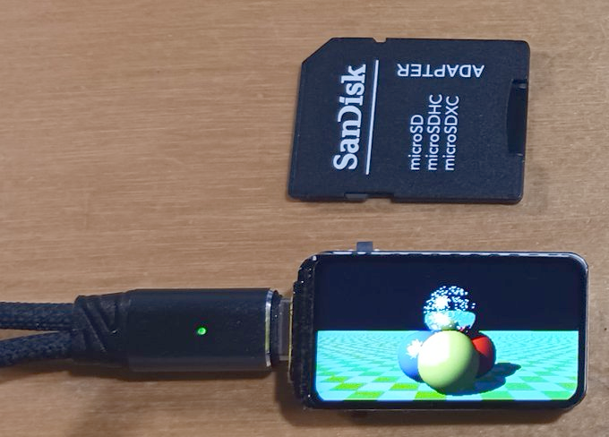

# phyllosoma
MachiKania type P (aka MachiKania Phyllosoma) for Waveshare RP2350-LCD-1.47 (hereafter referred to as RP2350-LCD-1.47)  


## MachiKania Phyllosoma
MachiKania Phyllosoma is a BASIC compiler for ARMv6-M, especially for Raspberry Pi Pico.

## how to compile 
cmake and make. The pico-sdk (ver 2.2.0 is confirmed for building) with all submodules (execute "Submodule Update" for git clone) is required. In config.cmake, select configuration option to build by enabling "set()" command. Currently, there is following option:  
  
1. set(MACHIKANIA_BUILD rp2350_lcd_1_47)  
2. Add "-DPICO_BOARD=pico2 -DPICO_PLATFORM=rp2350-arm-s" parameter to execute cmake, then execute make.  

## License
Most of codes (written in C) are provided with LGPL 2.1 license, but some codes are provided with the other licenses. See the comment of each file.

## Port assignment
The I/O ports are assigned as follows:

```console
GP0 I/O bit0 / PWM3
GP1 I/O bit1 / PWM2
GP2 I/O bit2 / PWM1
GP3 I/O bit3 / SPI CS
GP4 I/O bit4 / UART TX
GP5 I/O bit5 / UART RX
GP6 I/O bit6 / I2C SDA
GP7 I/O bit7 / I2C SCL
GP8 I/O bit8 / button1 (UP) / SPI RX
GP9 I/O bit9 / button2 (LEFT)
GP10 SD-SCLK
GP11 SD_DI(MOSI)
GP12 SD_DO(MISO)
GP13 SD_D1
GP14 SD_D2
GP15 SD_CS
GP16 LCD_DC
GP17 LCD_CS
GP18 LCD_CLK
GP19 LCD_DIN(MOSI)
GP20 LCD_RST
GP21 LCD_BL
GP22 I/O bit15 / RGB_IO(WS2812B)
GP23 (NC)
GP24 (NC)
GP25 I/O bit10 / button3 (RIGHT)
GP26 I/O bit11 / button4 (DOWN) / ADC0 / SCK
GP27 I/O bit12 / button5 (START) / ADC1 / SPI TX
GP28 I/O bit13 / SOUND OUT / ADC2
GP29 I/O bit14 / button6 (FIRE) / ADC3
```
## Using Keyboard
The phyllosoma_kb.uf2 firmware supports using USB keyboard. Connect the USB keyboard to micro C socket of RP2350-LCD-1.47-A through an USB-OTG cable with power port.

## Using arrow keys for button function
The four arrow keys and S/F keys of keyboard emulate button functions of MachiKania. To change the assignment (which keys are used for which button), edit MACHIKAP.INI (EMULATEBUTTONxx=yyy etc). 

## LCD settings
To adjust direction of LCD, set "HORIZONTAL", "VERTICAL", "LCD180TURN", or "LCD90TURN" in MACHIKAP.INI.


