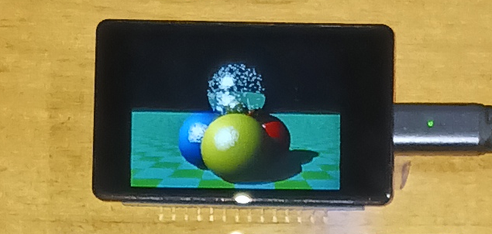
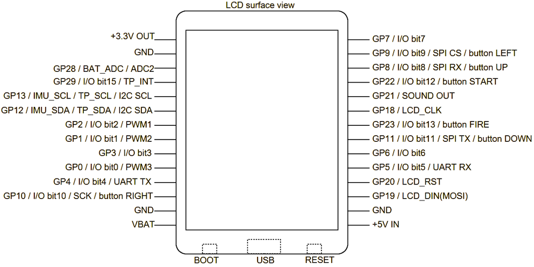

# phyllosoma
MachiKania type P (aka MachiKania Phyllosoma) for Waveshare RP2350-Touch-LCD-2 (hereafter referred to as RP2350-LCD-2)  


## MachiKania Phyllosoma
MachiKania Phyllosoma is a BASIC compiler for ARMv6-M, especially for Raspberry Pi Pico.

## how to compile 
cmake and make. The pico-sdk (ver 2.2.0 is confirmed for building) with all submodules (execute "Submodule Update" for git clone) is required. In config.cmake, select configuration option to build by enabling "set()" command. Currently, there is following option:  
  
1. set(MACHIKANIA_BUILD rp2350_lcd_2)  

Add "-DPICO_BOARD=pico2 -DPICO_PLATFORM=rp2350-arm-s" parameter to execute cmake, then execute make.  

## License
Most of codes (written in C) are provided with LGPL 2.1 license, but some codes are provided with the other licenses. See the comment of each file.

## Port assignment
The I/O ports are assigned as follows:

```console
GP0 I/O bit0 / PWM3
GP1 I/O bit1 / PWM2
GP2 I/O bit2 / PWM1
GP3 I/O bit3
GP4 I/O bit4 / UART TX
GP5 I/O bit5 / UART RX
GP6 I/O bit6
GP7 I/O bit7
GP8 I/O bit8 / SPI RX / button1 (UP)
GP9 I/O bit9 / SPI CS / button2 (LEFT)
GP10 I/O bit10 / SCK / button3 (RIGHT)
GP11 I/O bit11 / SPI TX / button4 (DOWN)
GP12 IMU_SDA / TP_SDA / I2C SDA
GP13 IMU_SCL / TP_SCL / I2C SCL
GP14 I/O bit14 / IMU_INT1
GP15 LCD_BL
GP16 LCD_DC
GP17 LCD_CS
GP18 LCD_CLK
GP19 LCD_DIN(MOSI)
GP20 LCD_RST
GP21 SOUND OUT
GP22 I/O bit12 / button5 (START)
GP23 I/O bit13 / button6 (FIRE)
GP24 SD_DO(MISO)
GP25 SD_CS
GP26 SD-SCLK
GP27 SD_DI(MOSI)
GP28 BAT_ADC / ADC2
GP29 I/O bit15 / TP_INT
```

For more details on the pin layout of the RP2350-LCD-2, please refer to [Waveshare's wiki site](https://www.waveshare.com/wiki/RP2350-Touch-LCD-2).

## Using Keyboard
The phyllosoma_kb.uf2 firmware supports using USB keyboard. Connect the USB keyboard to Type-C socket of RP2350-LCD-2 through an USB-OTG cable with power port.

## Using arrow keys for button function
The four arrow keys and S/F keys of keyboard emulate button functions of MachiKania. To change the assignment (which keys are used for which button), edit MACHIKAP.INI (EMULATEBUTTONxx=yyy etc). 

## LCD settings
To adjust direction of LCD, set "HORIZONTAL", "VERTICAL", "LCD180TURN", or "LCD90TURN" in MACHIKAP.INI.
