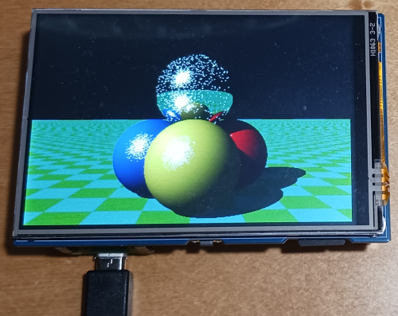

# phyllosoma
MachiKania type P (aka MachiKania Phyllosoma) for Waveshare Pico-ResTouch-LCD-3.5 (hereafter referred to as ResTouch)  


## MachiKania Phyllosoma
MachiKania Phyllosoma is a BASIC compiler for ARMv6-M, especially for Raspberry Pi Pico.

## how to compile for Raspberry Pi Pico
cmake and make. The pico-sdk (ver 2.1.1 is confirmed for building) with all submodules (execute "Submodule Update" for git clone) is required. In config.cmake, select configuration option to build by enabling "set()" command. Currently, there is following option:  
  
1. set(MACHIKANIA_BUILD pico_restouch) : for ResTouch

## how to compile for Raspberry Pi Pico W

Add "-DPICO_BOARD=pico_w -DPICO_PLATFORM=rp2040" parameter to execute cmake, then execute make. The config.cmake setting is the same as above.

## how to compile for Raspberry Pi Pico 2

Add "-DPICO_BOARD=pico2 -DPICO_PLATFORM=rp2350-arm-s" parameter to execute cmake, then execute make. The config.cmake setting is the same as above.

## how to compile for Raspberry Pi Pico 2 W

Add "-DPICO_BOARD=pico2_w -DPICO_PLATFORM=rp2350-arm-s" parameter to execute cmake, then execute make. The config.cmake setting is the same as above.

## how to use
Connect USB-micro B adaptor to ResTouch with pushing BOOTSEL button of Raspberry Pi Pico. Copy "phyllosoma_kb.uf2" to the RPI-RP2 (or RP2350) drive of Raspberry Pi Pico or Pico W. 

## License
Most of codes (written in C) are provided with LGPL 2.1 license, but some codes are provided with the other licenses. See the comment of each file.

## Port assignment
The I/O ports are assigned as follows:

```console
GP0 I/O bit0 / PWM3
GP1 I/O bit1 / PWM2
GP2 I/O bit2 / SRAM CS
GP3 I/O bit3 / SPI CS
GP4 I/O bit4 / UART TX
GP5 I/O bit5 / UART RX
GP6 I/O bit6 / I2C SDA
GP7 I/O bit7 / I2C SCL
GP8 LCD-DC
GP9 LCD-CS
GP10 LCD-SCK / SD-SCLK
GP11 LCD-MOSI / SD-DI(MOSI)
GP12 LCD-MISO / SD-DO(MISO)
GP13 I/O bit8 / LCD-BackLight / PWM1
GP14 
GP15 LCD-RESET
GP16 I/O bit9 / TP-CS
GP17 I/O bit10 / TP-IRQ / button1 (UP)
GP18 I/O bit11 / button2 (LEFT)
GP19 I/O bit12 / button3 (RIGHT)
GP20 I/O bit13 / button4 (DOWN)
GP21 I/O bit14 / button5 (START)
GP22 SD-CS
GP26 I/O bit15 / button6 (FIRE) / ADC0
GP27 SOUND OUT / ADC1
GP28 ADC2
GP29 ADC3
```
## Using Keyboard
The phyllosoma_kb.uf2 firmware supports using USB keyboard. Connect the USB keyboard to micro B socket of Raspberry Pi pico (or Pico W) through an USB-OTG cable with power port.

## Using arrow keys for button function
The four arrow keys and S/F keys of keyboard emulate button functions of MachiKania. To change the assignment (which keys are used for which button), edit MACHIKAP.INI (EMULATEBUTTONxx=yyy etc). 

## LCD settings
To adjust direction of LCD, set "HORIZONTAL", "VERTICAL", "LCD180TURN", or "LCD90TURN" in MACHIKAP.INI.

## Touch screen
To use touch screen, the TSC2046 class is provided in class library (LIB directory).

